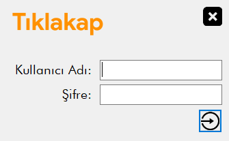

# Stok Takip (C#)

### [Discord chat](https://discord.gg/x7f6RASH8P)

## Features
#### - Auto-Change proxy
TBS can change proxy by itself. This means you are far less likely to be banned for using a bot. Main reason for a bot ban is high activity from same IP (12h+). TBS supports proxy authentication.
#### - Auto-Settle new villages
TBS can find appropriate valleys to settle around your capital village. Or you can input coordinates in advance and it will automatically settle one valley after another.
#### - Auto-Fill troops and send resources to/from capital
TBS will automatically send resources from capital village to off/deff villages, train troops there and send the remaining resources back. This is a perfect feature for any deff account.
#### - Login
Panel login form

#### - Select

#### - Category

#### - Products

#### - Stats - Product, Category, City vs.

